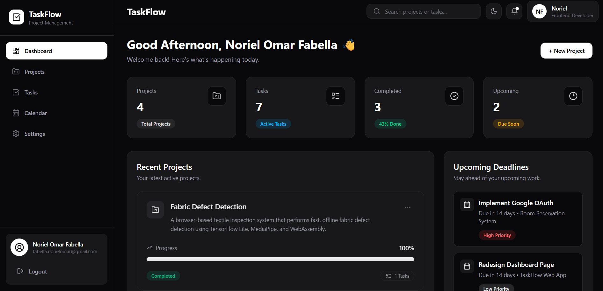
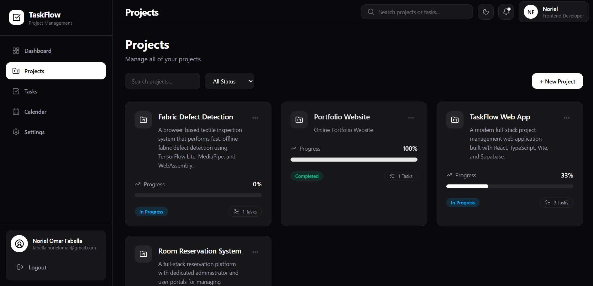
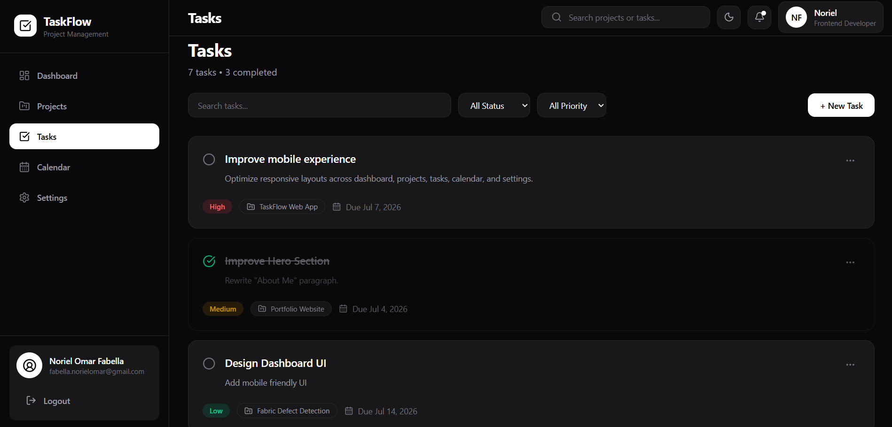
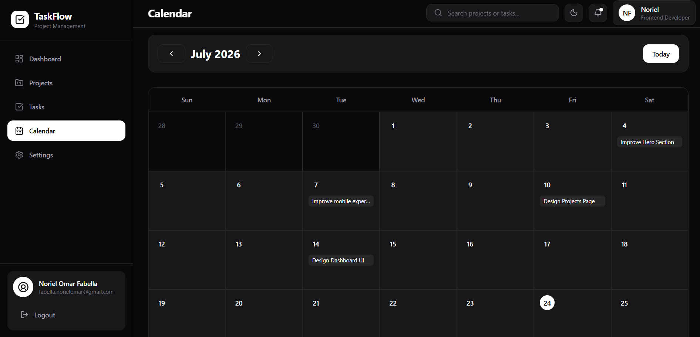
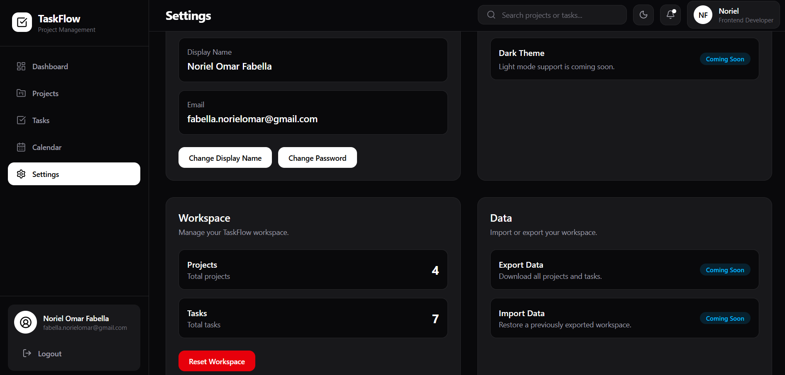
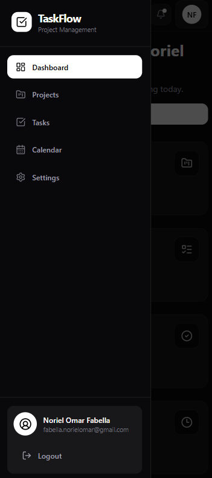

# TaskFlow

<p align="center">


</p>

A modern **full-stack project management web application** built with **React, TypeScript, Vite, and Supabase**.

TaskFlow helps individuals organize projects, manage tasks, monitor productivity, and track deadlines through a clean, responsive, and intuitive interface. It features secure authentication, project and task management, calendar scheduling, activity tracking, and Google Sign-In.

---

# 🌐 Live Demo

**Application**

https://YOUR-VERCEL-URL.vercel.app

---

# 📸 Screenshots

## Dashboard



---

## Projects



---

## Tasks



---

## Calendar



---

## Settings



---

## Mobile Responsive



> Replace these placeholder image paths with your own screenshots or GitHub image URLs.

---

# ✨ Features

## 🔐 Authentication

- Email & Password Authentication
- Google Sign-In (OAuth)
- Protected Routes
- Persistent Login Sessions

---

## 📊 Dashboard

- Real-time project statistics
- Task completion overview
- Recent projects
- Recent tasks
- Upcoming deadlines
- Overdue tasks
- Activity feed

---

## 📁 Project Management

- Create, edit, and delete projects
- Project descriptions
- Automatic progress tracking
- Project status overview

---

## ✅ Task Management

- Create, edit, and delete tasks
- Associate tasks with projects
- Task priorities
- Due dates
- Mark tasks as completed

---

## 📅 Calendar

- Monthly calendar view
- Daily task overview
- Deadline visualization

---

## ⚙️ Settings

- Update profile information
- Change password
- Workspace information
- Data management

---

## 📱 Responsive Design

- Mobile-first layout
- Responsive navigation drawer
- Adaptive dashboard
- Optimized cards and modals

---

# 🛠 Tech Stack

| Category | Technologies |
|----------|--------------|
| **Frontend** | React, TypeScript, Vite, Tailwind CSS |
| **Routing** | React Router |
| **Backend** | Supabase |
| **Database** | PostgreSQL (Supabase) |
| **Authentication** | Supabase Auth, Google OAuth |
| **Notifications** | Sonner |
| **Icons** | Lucide React |
| **Deployment** | Vercel |
| **Version Control** | Git & GitHub |

---

# 📂 Project Structure

```text
TaskFlow
│
├── frontend
│   ├── public
│   ├── src
│   │   ├── assets
│   │   ├── components
│   │   ├── features
│   │   ├── hooks
│   │   ├── pages
│   │   ├── services
│   │   ├── types
│   │   └── ...
│   │
│   ├── package.json
│   └── vite.config.ts
│
└── README.md
```

---

# 🚀 Getting Started

## Clone the repository

```bash
git clone https://github.com/NorielFabella/TaskFlow.git
```

## Navigate to the project

```bash
cd TaskFlow/frontend
```

## Install dependencies

```bash
npm install
```

## Configure environment variables

Create a `.env` file.

```env
VITE_SUPABASE_URL=your_supabase_url
VITE_SUPABASE_ANON_KEY=your_supabase_anon_key
```

## Run the development server

```bash
npm run dev
```

## Build for production

```bash
npm run build
```

---

# 🎯 Learning Objectives

TaskFlow was developed to strengthen practical experience with:

- React + TypeScript
- Component-based architecture
- Context API
- Custom Hooks
- CRUD operations
- Authentication
- Relational database design
- Responsive UI development
- Full-stack deployment
- Production-ready development workflows

---

# 🔮 Future Improvements

- Drag-and-drop Kanban board
- Advanced search & filtering
- Labels & tags
- Team collaboration
- Notifications
- File attachments
- Email reminders
- Recurring tasks

---

# 👨‍💻 Author

**Noriel Omar R. Fabella**

Frontend Developer

- 🌐 Portfolio: https://noriel-portfolio-three.vercel.app
- 💻 GitHub: https://github.com/NorielFabella
- 💼 LinkedIn: https://linkedin.com/in/noriel-omar-fabella

---

# 📄 License

This project is licensed under the MIT License.